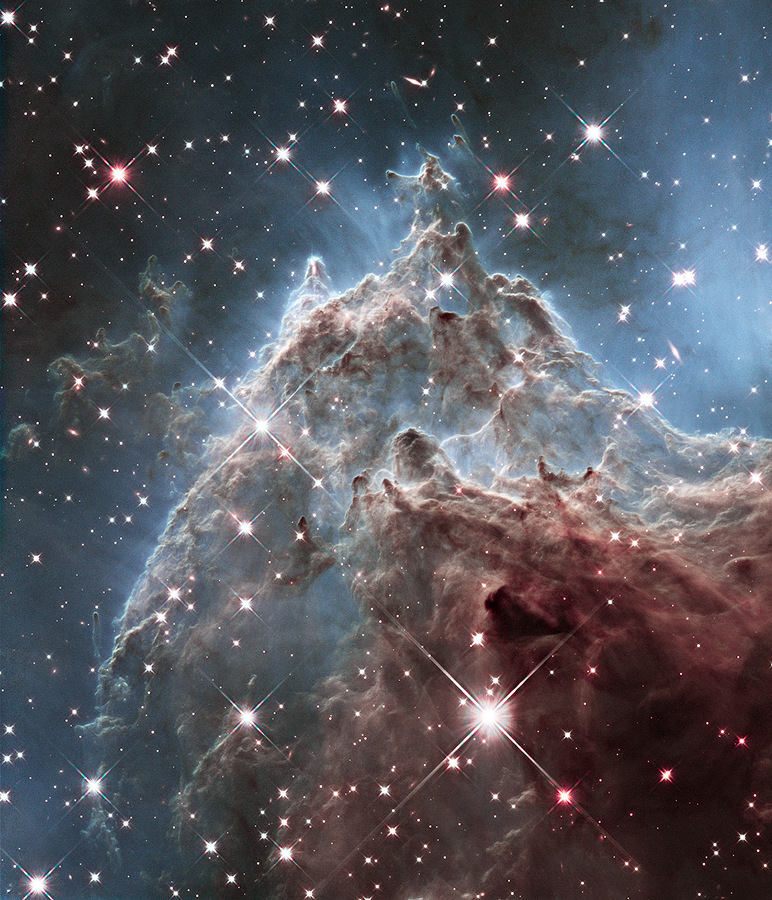

## API4
Программа скачивает фотографии с сайта NASA используя API, также присутствует код для отправки скачанных файлов при помощи телеграм-бота.
## Подробнее по отдельности

## ```get_APOD.py```
 
\
APOD - [Astronomy Picture of the Day](https://apod.nasa.gov/apod/astropix.html). \
Как нетрудно догадаться, этот код скачивает лучшие астрономические фотографии дня.
Можно скачать случайные фотографии, за какой-то день, или промежуток дней. Функция вызывается при помощи командной строки.
Скачанные файлы сохраняются в файле `Photos_of_the_day` в рабочей директории, (если нет создается)\
Вот инструкция по аргументам:
```commandline
(venv) C:\Python\Python_from_0\Devman\API4>python C:\Python\Python_from_0\Devman\API4\get_APOD.py --h
usage: get_APOD.py [-h] [--count COUNT] [--day DAY] [--days DAYS]

Программа скачивает фотографии дня в файл "Photos_of_the_day" в рабочей директории, (если нет создает)

optional arguments:
  -h, --help     show this help message and exit
  --count COUNT  Укажите количество случайных фотографий
  --day DAY      Укажите день, за который нужно получить фото, в формате YYYY-MM-DD
  --days DAYS    Укажите промежуток дней, за которые хотите получить фотографии, в формате YYYY-MM-DD-YYYY-MM-DD
```

## ```get_EPIC.py```

EPIC - [Earth Polychromatic Imaging Camera](https://epic.gsfc.nasa.gov/) \
Данный скрипт скачивает фотографии земли. Программа может скачать последние фотографии,
за определенную дату или сколько-то рандомных фотографий сохраняет в файл `Earth_photos`
в рабочей директории, (если нет создает). Вызывается при помощи командной строки.\
Инструкция по аргументам:
```commandline
(venv) C:\Python\Python_from_0\Devman\API4>python C:\Python\Python_from_0\Devman\API4\get_EPIC.py --h
usage: get_EPIC.py [-h] [--count COUNT] [--date DATE] [--random_count RANDOM_COUNT]

Программа скачивает фотографии земли в файл "Earth_photos" в рабочей директории, (если нет создает)

optional arguments:
  -h, --help            show this help message and exit
  --count COUNT         Укажите количество фотографий, программа выведет указанное количество последних фотографий
  --date DATE           Укажите дату в формате YYYY-MM-DD, программа выведет фото этого дня, если оно есть
  --random_count RANDOM_COUNT
                        Если нужно сколько-то рандомных фотографий, нужно ввести число
```

## ```get_spacex_images.py```
 \
Программа скачивает фотографии с запуска Spacex по ID этого запуска, указывается
следующим образом: --id ID.(id можно получить по [ссылке](https://api.spacexdata.com/v5/launches/)). Сохраняет в файл "Images_spacex" (если нет создает). Если она не будет указана загрузятся фотографии последнего запуска, для которой есть
фотографии.\
Инструкция по аргументам:
```commandline
(venv) C:\Python\Python_from_0\Devman\API4>python C:\Python\Python_from_0\Devman\API4\get_spacex_images.py --h
usage: get_spacex_images.py [-h] [--id ID]

Программа загружает кадры запуска Spacex в файл Images_spacex (если нет создает)по ID этого запуска, указывается
следующим образом: --id ID. Если она не будет указана загрузятся фотографии поледнего запуска, для которой есть
фотографии,

optional arguments:
  -h, --help  show this help message and exit
  --id ID     укажите ID запуска
```

## ```NASA_top_photo_bot.py```
Данный код сделан для общения с телеграм-ботом. Бот присылает фотографии из указанной директории, с указанным периодом (дефолтно период равен 4-ем часам),
если фотографии закончатся, начнет в случайном порядке присылать фотографии.
Запускается при помощи командной строки.\
Инструкция по аргументам:
```commandline
(venv) C:\Python\Python_from_0\Devman\API4>python NASA_top_photo_bot.py --h
usage: NASA_top_photo_bot.py [-h] [--directory DIRECTORY] [--period PERIOD]

Бот присылает фотографии из указанной директории(дефолтно равен Photos_of_the_day), с указанным периодом (дефолтно
период равен 4ем часам), если фотографии закончатся, начнет случайном порядке присылась фотографии

optional arguments:
  -h, --help            show this help message and exit
  --directory DIRECTORY
                        Укажите путь к папке из которой необходимо присылать фотографии
  --period PERIOD       Укажите период между отправками сообщений, в формате число + текст, например: 12s (равно 12
                        сек); 1.2h2m1c (равно 1.2*60*60+2*60+1=4441 сек); 1day (равно 86400). Дефолтно период равен
                        4-ем часам
```

## Подготовка к работе

1. Скачать весь проект к себе.  
Установить библиотеки:
```python:
pip install -r requirements.txt
```
  
2. Необходим API ключ от NASA. [Ссылка на получение](https://api.nasa.gov/)

3. Необходим API ключ от вашего телеграм-бота, [вот ссылка](https://way23.ru/%D1%80%D0%B5%D0%B3%D0%B8%D1%81%D1%82%D1%80%D0%B0%D1%86%D0%B8%D1%8F-%D0%B1%D0%BE%D1%82%D0%B0-%D0%B2-telegram.html)
, перейдя по нему узнаете как создать бота и как получить ключ. 


4. Создайте файл `.env`поблизости с основным кодом. \
В него необходимо записать:

```python:
TG_TOKEN = 'Ваш токен'
NASA_API = 'Ваш токен от NASA'
TG_CHAT_ID = 'ID вашего чата в телеграм)
```


6. Осталось только запустить программу.
