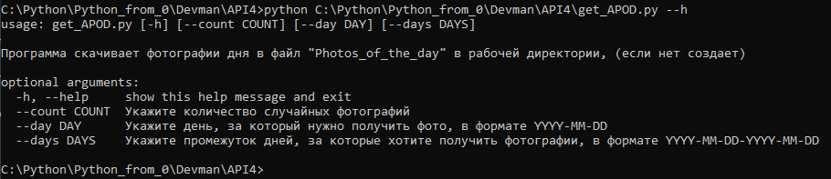
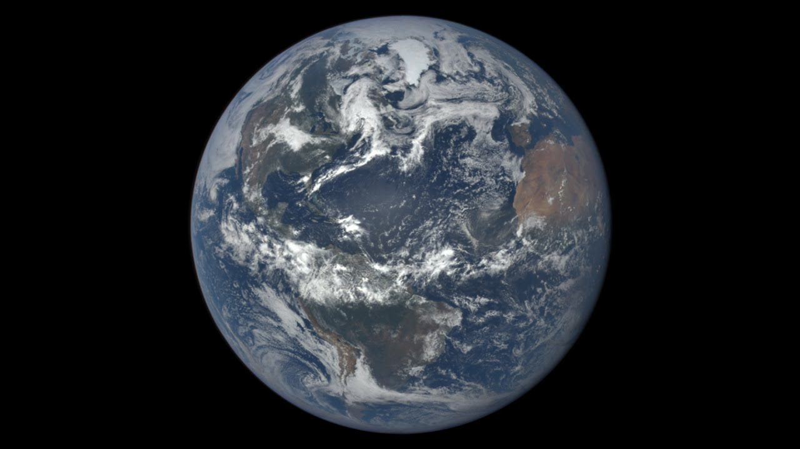
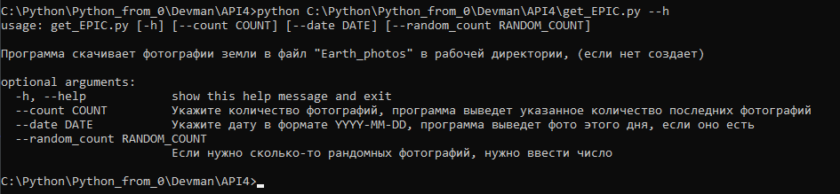
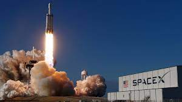
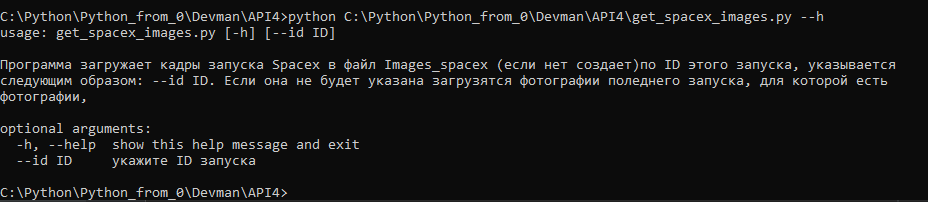
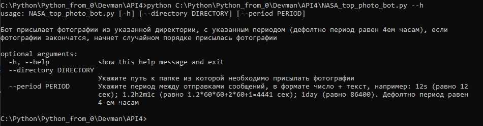

## API4
Программа скачивает фотографии с сайта NASA используя API, также присутствует код для отправки скачанных файлов при помощи телеграм-бота.
## Подробнее по отдельности

### ```get_APOD.py```

APOD - [Astronomy Picture of the Day](https://apod.nasa.gov/apod/astropix.html). \
Как нетрудно догадаться, этот код скачивает лучшие астрономические фотографии дня.
Можно скачать случайные фотографии, за какой-то день, или промежуток дней. Функция вызывается при помощи командной строки.
Скачанные файлы сохраняются в файле "Photos_of_the_day" в рабочей директории, (если нет создается)\
Вот инструкция по аргументам:

----
### ```get_EPIC.py```

EPIC - [Earth Polychromatic Imaging Camera](https://epic.gsfc.nasa.gov/) \
Данный скрипт скачивает фотографии земли. Программа может скачать последние фотографии,
за определенную дату или сколько-то рандомных фотографий сохраняет в файл "Earth_photos"
в рабочей директории, (если нет создает). Вызывается при помощи командной строки.\
Инструкция по аргументам:

----
### ```get_spacex_images.py```
 \
Программа скачивает фотографии с запуска Spacex по ID этого запуска, указывается
следующим образом: --id ID.(id можно получить по [ссылке](https://api.spacexdata.com/v5/launches/)). Сохраняет в файл "Images_spacex" (если нет создает). Если она не будет указана загрузятся фотографии поледнего запуска, для которой есть
фотографии.\
Инструкция по аргументам:

----
### ```NASA_top_photo_bot.py```
Данный код сделан для общения с телеграм-ботом. Бот присылает фотографии из указанной директории, с указанным периодом (дефолтно период равен 4-ем часам),
если фотографии закончатся начнет случайном порядке присылась фотографии.
Запускается при помощи командной строки.
Инструкция по аргументам:


##Подготовка к работе

1. Скачать весь проект к себе.  
Установить библиотеки:
```pip install -r requirments.txt```
  
2. Необходим API ключ от NASA. [Ссылка на получение](https://api.nasa.gov/)

4. Необходим API ключ от вашего телеграм-бота, [вот ссылка](https://way23.ru/%D1%80%D0%B5%D0%B3%D0%B8%D1%81%D1%82%D1%80%D0%B0%D1%86%D0%B8%D1%8F-%D0%B1%D0%BE%D1%82%D0%B0-%D0%B2-telegram.html)
, перейдя по нему узнаете как создать бота и как получить ключ. 


4. Создайте файл ```.env```поблизости с основным кодом. \
В него необходимо записать:

```TG_TOKEN = 'Ваш токен'```\
```API = 'Ваш токен от NASA' ```


6. Осталось только запусткать программы.
